# Banners

These were the banners for the 2022 season of DBZ league

[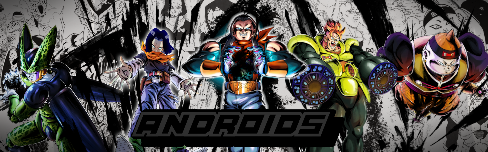 ](./images/2022/androids.png)
[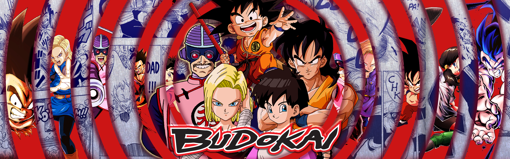 ](./images/2022/budokai.png)
[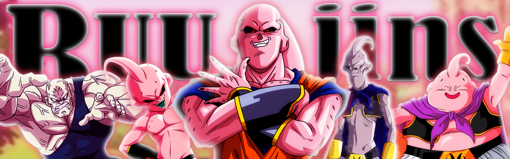 ](./images/2022/buujins.png)
[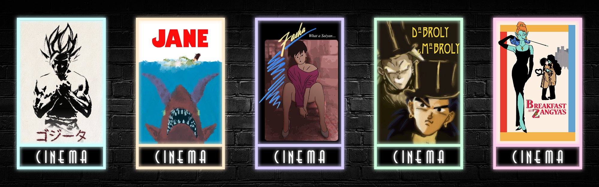 ](./images/2022/cinema.png)

[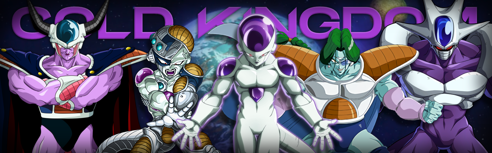 ](./images/2022/coldKingdom.png)
[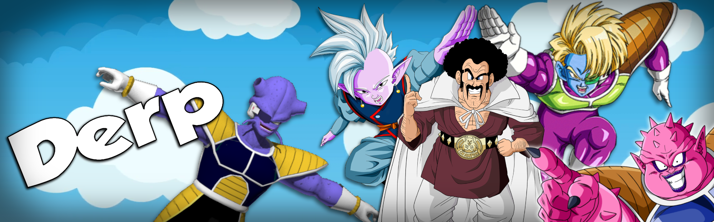 ](./images/2022/derp.png)
[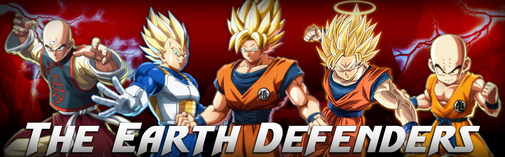 ](./images/2022/earthDefenders.png)
[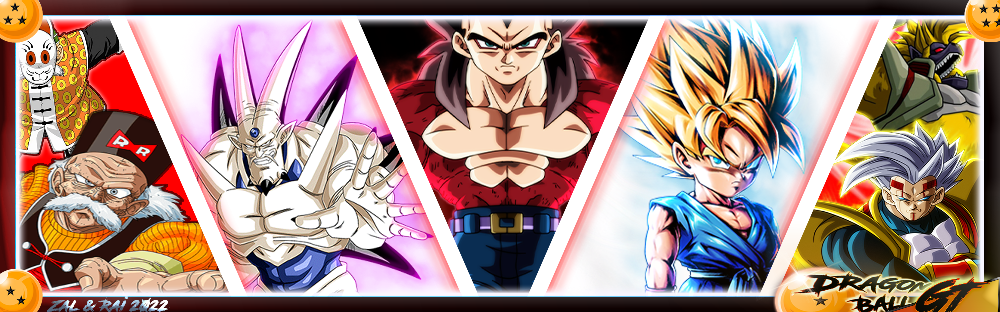 ](./images/2022/gt.png)

[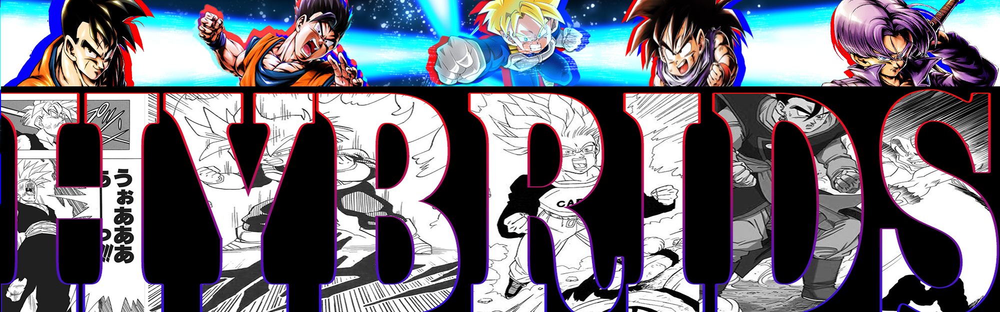 ](./images/2022/budokai.png)
[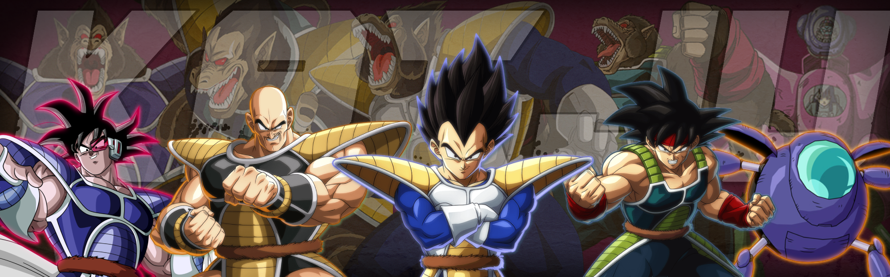 ](./images/2022/kaiju.png)
[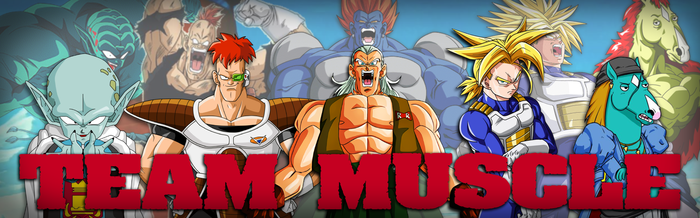 ](./images/2022/muscle.png)
[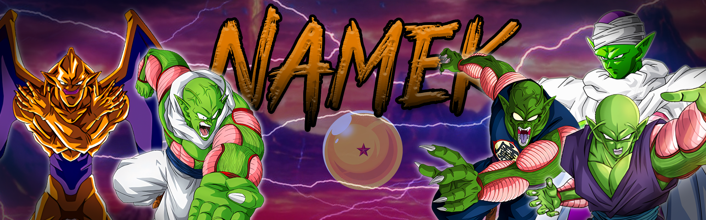 ](./images/2022/namek.png)

[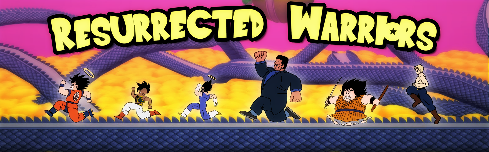 ](./images/2022/resurrectedWarriors.png)
[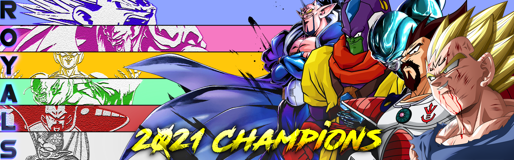 ](./images/2022/royals.png)
[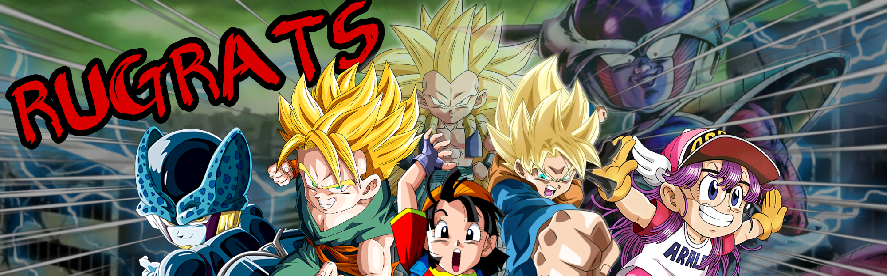 ](./images/2022/rugrats.png)
[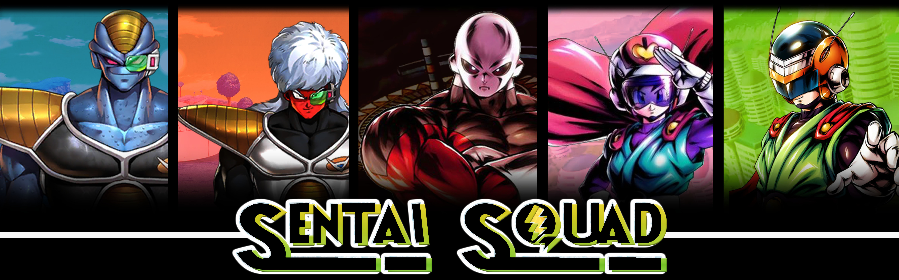 ](./images/2022/sentai.jpg)