# Banners

These were the banners for the 2023 season of DBZ league

[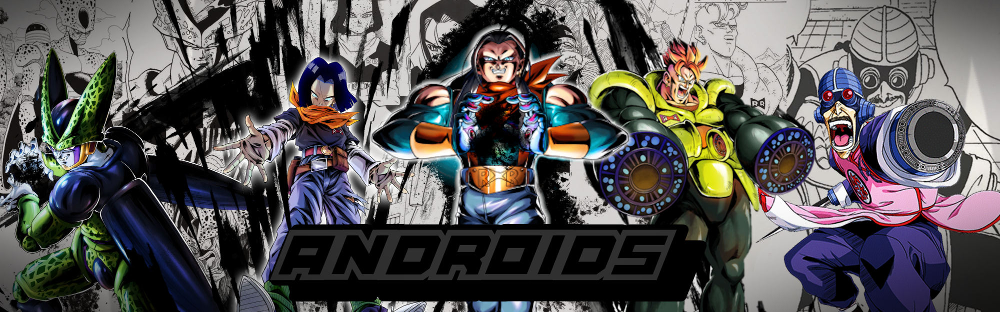 ](./images/2023/androids.png)
[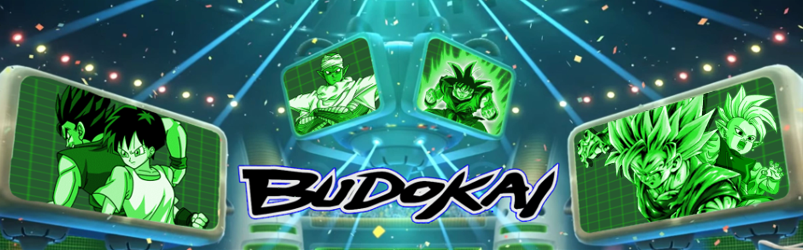 ](./images/2023/budokai.png)
[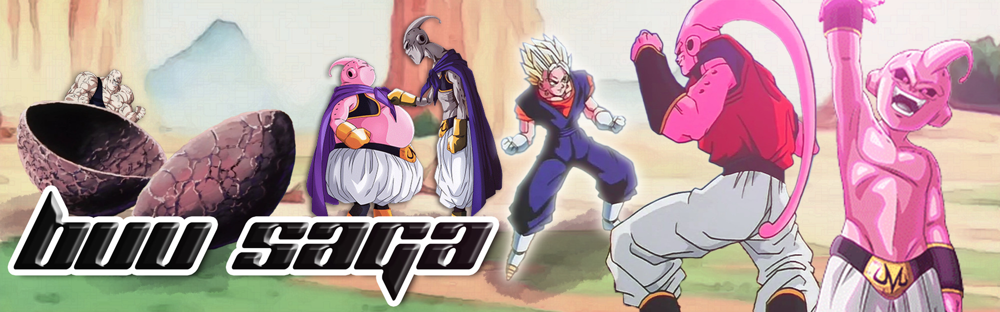 ](./images/2023/buuSaga.png)
[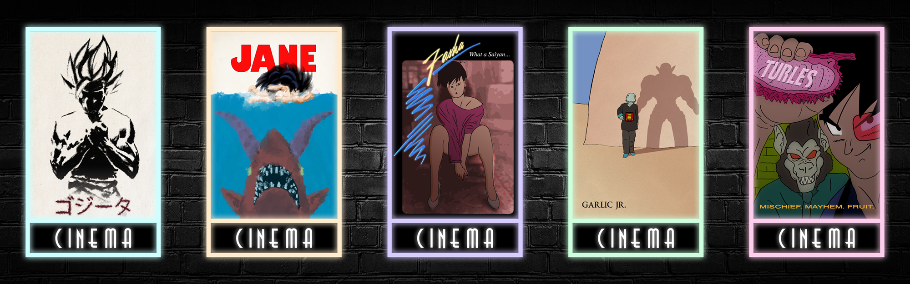 ](./images/2023/cinema.png)

[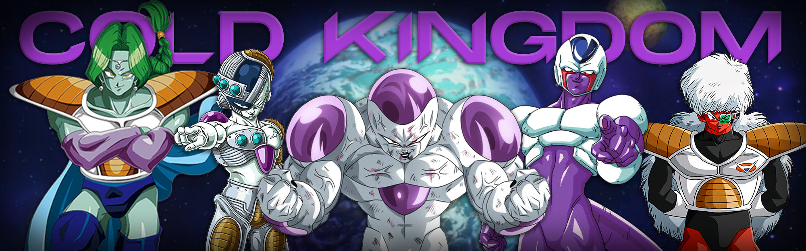 ](./images/2023/coldKingdom.png)
[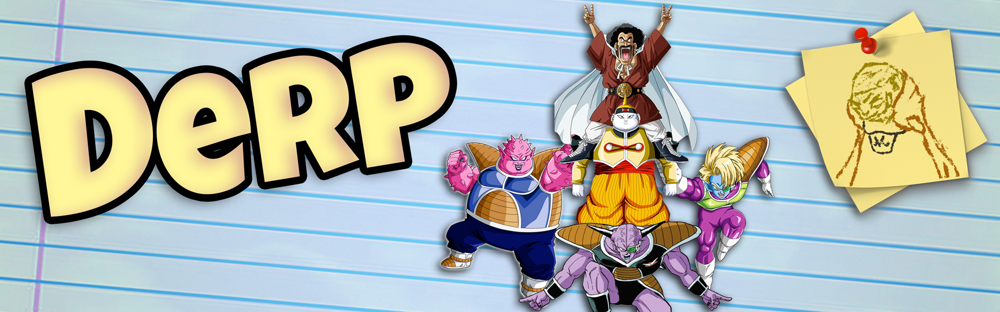 ](./images/2023/derp.png)
[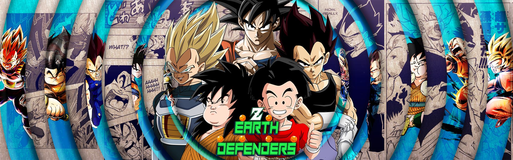 ](./images/2023/earthDefenders.png)
[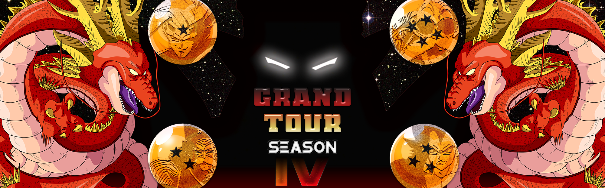 ](./images/2023/gt.png)

[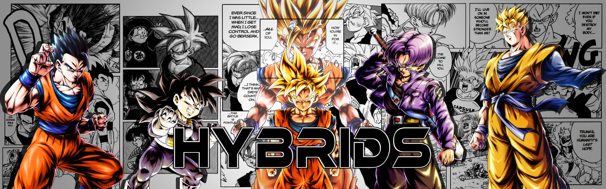 ](./images/2023/budokai.png)
[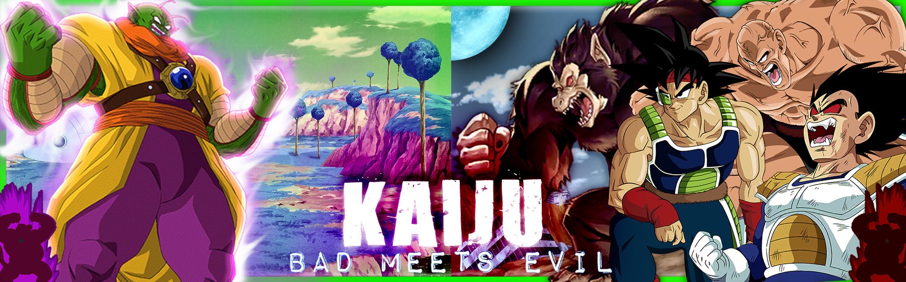 ](./images/2023/kaiju.png)
[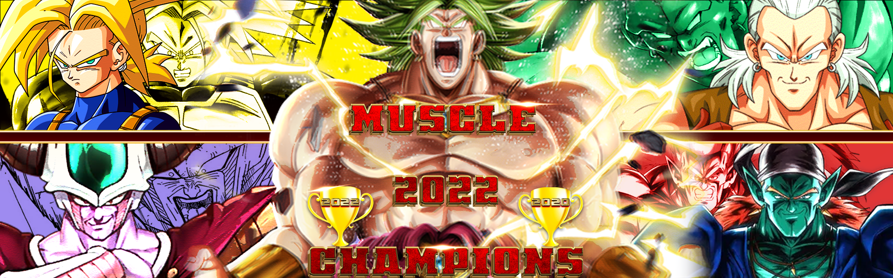 ](./images/2023/muscle.png)
[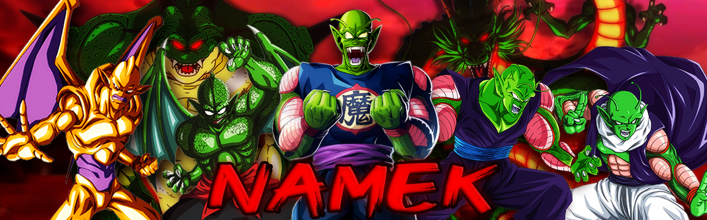 ](./images/2023/namek.png)

[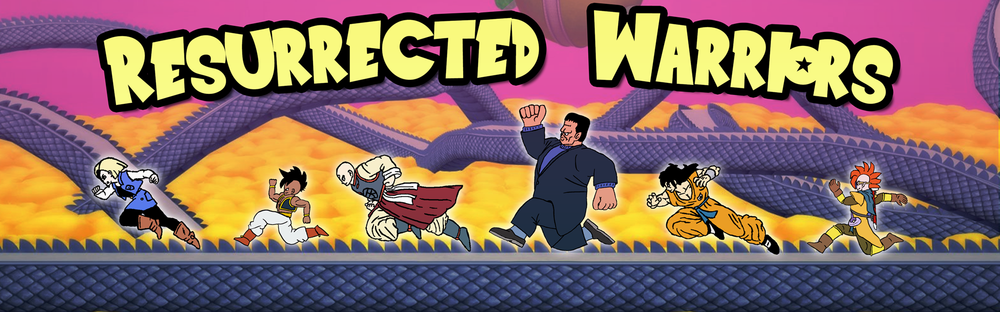 ](./images/2023/resurrectedWarriors.png)
[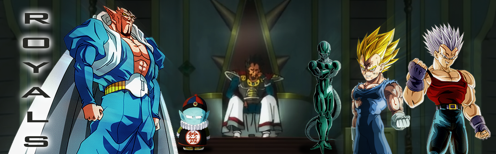 ](./images/2023/royals.png)
[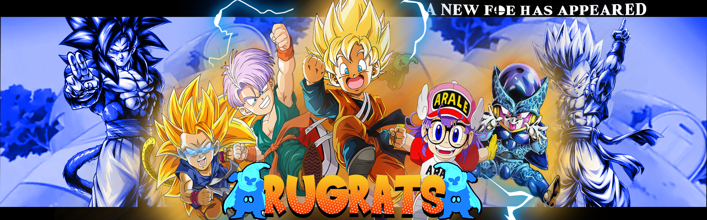 ](./images/2023/rugrats.png)
[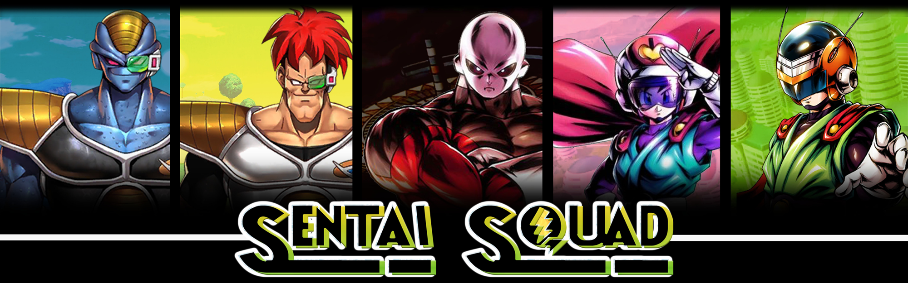 ](./images/2023/sentai.png)