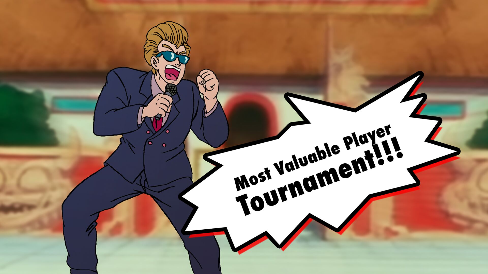
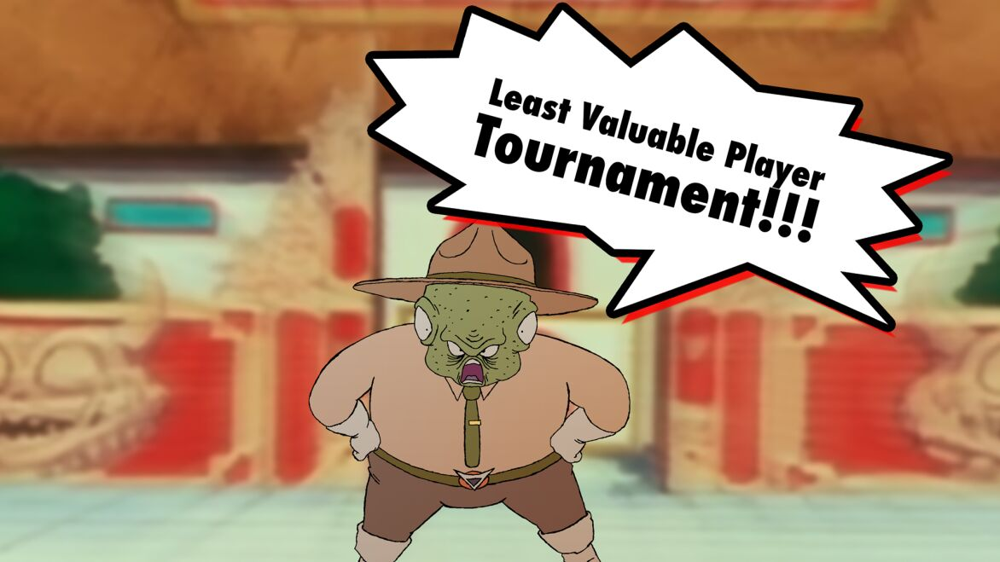

### Ringout matches

Ringout matches are 1v1 fights hosted on the World Martial Arts tournament map, with ringouts turned on. So fighters have 2 
ways to win: the old-fashioned way of taking out all your opponents HP or simply making them touch the ground outside the ring. 

The two main versions of this that we have are the Most Valuable Player Tournament (MVP)  and the Least Valuable Player Tournament
(LVP).

#### Most Valuable Player (MVP) Tournament

The MVP tournament takes the player from each team with the highest average damage and pits them in a single elimination 
match, with the winner proceeding.

Normal Build rules apply, and characters with limiters will also have those limiters on their builds.

#### Least Valuable Player (LVP)

If the MVP tournament is about finding the best of the best, the LVP is about finding the worst of the worst. Your representative
will be the character on your team with the lowest average damage.  The tournament is single elimination as well, BUT the 
LOSER of the match proceeds, not the winner. 

Despite this, your character must have a 7 pt build, and if you have a limiter, that will also be on your build.

#### Other notes

While your default representative will be determined by the average damage statistic, if you think another character deserves the
title of "MVP" or "LVP" of your team, you can present your reasoning to staff and try to convince us to make that change.