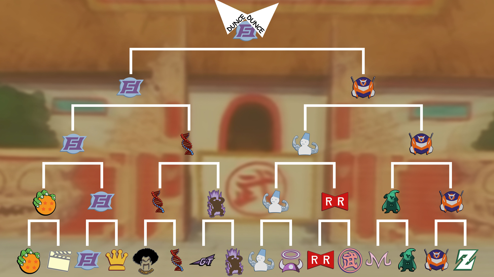

### Schedule 

### Team Builds (Click to reveal)

  
Androids

 - Android 19 - Costume 2
     - Unleash Latent Power 3 (4)
     - Master Blast (1)
     - Charged Attack (1)
     - High Spot (1)
     - Majin Buu AI
   

  
Budokai

  
 - Early Costume - Costume 4
     - Attack +2 Defense -1
     - Savior (1)
     - Launch's Support (2)
     - Secret Measures (3)
     - Yajirobe AI
  

  
Buujins

 - Majuub - Costume 2
     - Super +2 Ki -1 (1)
     - Aura Charge (Pink) (1)
     - Halo-Lite (4)
     - Rising Fighting Spirit (1)
  

  
Cinema

 - Zangya
     - Unleash Latent Power 3 (4)
     - Master Throw (1)
     - High Spot (1)
     - Persistent Threat (1)
     - Broly AI
  

  
Cold Kingdom 

  
 - Recoome
     - Defense +3 Attack -1 (2)
     - Eternal Life (4)
     - Light Body (1)
     - Tien AI
  

  
Derp

  
 - Gero
     - Attack +2 Defense -1 (1)
     - Serious! (1)
     - Quick Fast Attack (1)
     - Master Throw (1)
     - Dende's Healing Ability (2)
     - Light Body (1)
     - Gohan AI
  

  
Earth Defenders

  
 - Mid Goku - Costume 4
     - Super +2 Ki -1 (1)
     - Power of Rage (2)
     - Rising Fighting Spirit (1)
     - Indignation! (1)
     - Launch's Support (2)
     - Tien AI
  

  
GT

  
 - Pan - Costume 1
     - Super +1 (1)
     - Light Body (1)
     - Dragon Power (3)
     - Launch's Support (2)
     - Chiaotzu AI
  

  
Hybrids

 - Sword Trunks
     - Defense +2 (2)
     - Indignation! (1)
     - Fighting Spirit! (1)
     - Launch's Support (2)
     - Master Blast (1)
     - Broly's Ring (Limiter)
     - Chiaotzu AI
  

  
Kaiju

  
 - Raditz
     - Attack +1 (1)
     - Serious! (1)
     - Latent Energy! (1)
     - Quick Fast Attack (1)
     - Dragon Power (3)
     - Broly AI
  

  
Muscle

 - Master Roshi
     - Ki Power +2 Super -1 (1)
     - Rising Fighting Spirit (1)
     - Launch's Support (2)
     - Fighting Spirit! (1)
     - Indignation! (1)
     - Flight (1)
     - Ginyu AI
  

  
Namek

  
 - King Piccolo
     - Attack +1 (1)
     - Halo-Lite (4)
     - Dende's Healing Ability (2)
     - Yajirobe AI
  

  
Resurrected Warriors

 - Videl - Costume 2
     - Attack +2 Defense -1 (1)
     - Combo Master (1)
     - Master Throw (1)
     - Quick Fast Attack (1)
     - Fighting Spirit! (1)
     - Power of Rage (2)
     - Recoome AI
  

  
Royals

  
 - Mecha Frieza
     - Ki Power +1 (1)
     - Rising Fighting Spirit (1)
     - Launch's Support (2)
     - Secret Measures (3)
     - Recoome AI
  

  
Rugrats

  
 - Cell Jr - Costume 2
     - Ki +2 Super -1 (1)
     - Fighting Spirit! (1)
     - Dende's Healing Ability (2)
     - Launch's Support (2)
     - Active Heart (1)
     - Gohan AI
  

  
Sentai Squad

  
 - Burter
     - Ki +2 Super -1 (1)
     - Demon Seal-Lite (4)
     - Aura Charge (Ultimate 4) (1)
     - Master Blast (1)
     - Yajirobe AI
  

