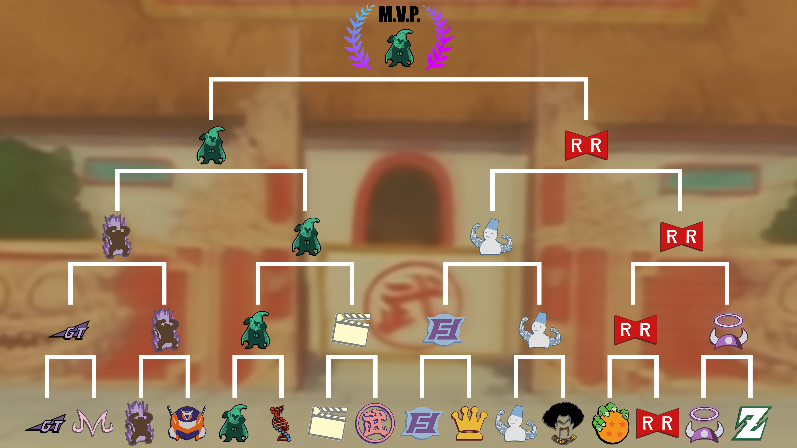

## Week 1

### Championship match Rounds 1 & 2

|  Home Team            | Away Team        | Winner          |
| :---------------------| :----------------| :---------------|
|  Muscle               | Rugrats          | Rugrats         |
|  Muscle               | Rugrats          | Muscle         |

### 3rd place exhibition match (Best of 3)

|  Home Team            | Away Team        | Winner          |
| :---------------------| :----------------| :---------------|
| Buujins               | Budokai          | Buujins         |
| Budokai               | Buujins          | Buujins         |

### Week 1 builds (Click to reveal)

<iframe width=600 height=500 scrolling="yes" src="https://docs.google.com/document/d/e/2PACX-1vS-vEJ4LDzKi_wMVzvkkfKqSx46rUTOMCQ-OkEqb4ygHnoaGfjOgKP-jtiOQSzK0CeGTCMXGs9qYTAF/pub?embedded=true"></iframe>

## Week 2

### Championship match Rounds 3-5 (4-5 if applicable)

|  Home Team            | Away Team        | Winner          |
| :---------------------| :----------------| :---------------|
|  Muscle               | Rugrats           |  Muscle        |
|  Muscle               | Rugrats           |  Muscle        |

### Championship Rounds 3-5 (Click to reveal)

<iframe width=600 height=500 src="https://docs.google.com/document/d/e/2PACX-1vTy3Bhvf8ZlZRCKxgzUbG0T2XM4FJ1e5GR4Z2bnYaozbxA3NZekRXzD7vZa_xhH5oe_lUyzqcKLPx7Q/pub?embedded=true"></iframe>

### MVP Tournament

## MVP builds

<iframe width=600 height=1000 scrolling="yes" src="https://docs.google.com/document/d/e/2PACX-1vQ0ohU_BQzCieg-qiT3XbIZPDggdsWHH1X3NrvOsw0NaiGtqHx1ruiW5pZ6S1VjrojygPbA2da3eod9/pub?embedded=true"></iframe>

### Gauntlet Teams

|  League Team          | Final round reached|
| :---------------------| :----------------| 
| North Kai             | Round 1          | 
| East Kai              | Round 1          | 
| West Kai              | Round 2          | 
| South Kai             | Round 2          | 

### Gaunltet builds

<iframe width=600 height=1000 scrolling"yes" src="https://docs.google.com/document/d/e/2PACX-1vSv-BRdTc7QRU7WK-YZuY_qDS03KQNs4jWCr0l1J4mbpcM97mAEPOA6dAMXxzxnq1dGUNt6O5YtQDa2/pub?embedded=true"></iframe>