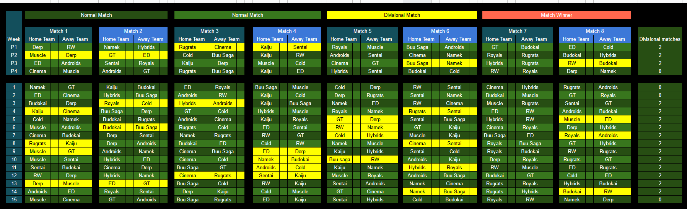

# 2023 Schedule 

## Schedule at a glance

If you want to see your team's schedule specifically, check [here](./scheduleByTeam.md).

## Stats spreadsheet

The stats spreadsheet for the season can be found [here](./stats.md).

These are the planned dates for the 2022 season. 

## Pre-Season
5/13/2023 - Week 1 
5/20/2023 - Week 2 
5/27/2023 - Week 3 
6/3/2023 - Week 4 

## Main Season
6/10/2023 - Week 1 
6/17/2023 - Week 2 
6/24/2023 - Week 3 
7/1/2023 - Week 4 
7/8/2023 - Week 5 
7/15/2023 - Week 6 
7/22/2023 - Week 7 
7/29/2023 - Week 8 
8/5/2023 - Week 9 
 
8/12/2023 - All-Star Break (warm up games) 
8/19/2023 - All-Star Game 

8/26/2023 - Week 10 
9/2/2023 - Week 11 
9/9/2023 - Week 12 
9/16/2023 - Week 13 
9/23/2023 - Week 14 
9/30/2023 - Week 15 
10/7/2023 - Least Valuable Player Tournament 

## Playoffs

10/14/2023 - Round 1 (Match 1) 
10/21/2023 - Round 1 (Match 2&3) 
10/28/2023 - Round 2 (Match 1) 
11/4/2023 - Round 2 (Match 2&3) 
11/11/2023 - Semi-Finals (Match 1) 
11/18/2023 - Semi-Finals (Match 2&3) 
11/25/2023 - Tenkaichi Bowl 
12/2/2023 - Tenkaichi Bowl week 2 

# Kai Placements

## North Kai 
* Cold
* Hybrids
* Androids
* Royals

## East Kai
* Kaiju
* Sentai Squad
* Cinema
* Rugrats

## West Kai
* GT
* Derp
* Muscle
* Earth Defenders

## South Kai
* Resurrected Warriors
* Namek
* Buu Saga
* Budokai
