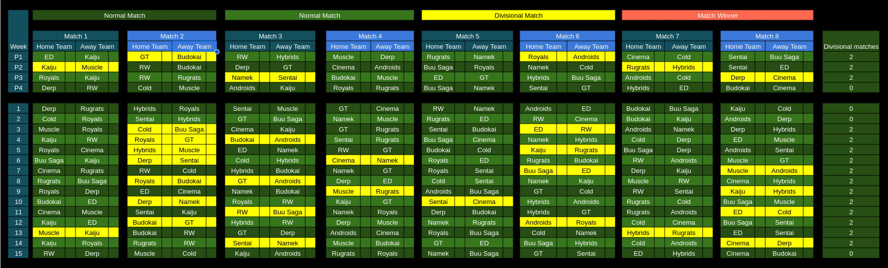

# 2024 Schedule 

## Schedule at a glance

If you want to see your team's schedule specifically, check [here](./scheduleByTeam.md).

## Stats spreadsheet

The stats spreadsheet for the season can be found [here](./stats.md).

These are the planned dates for the 2022 season. 

## Pre-Season
5/11/2024 - Week 1 
5/18/2024 - Week 2 
5/25/2024 - Week 3 
6/1/2024 - Week 4 

## Main Season
6/8/2024 - Week 1 
6/15/2024 - Week 2 
6/22/2024 - Week 3 
6/29/2024 - Week 4 
7/6/2024 - Week 5 
7/13/2024 - Week 6 
7/20/2024 - Week 7 
7/27/2024 - Week 8 
8/3/2024 - Week 9 
 
8/10/2024 - All-Star Break (warm up games) 
8/17/2024 - All-Star Game 

8/24/2024 - Week 10 
8/31/2024 - Week 11 
9/7/2024 - Week 12 
9/14/2024 - Week 13 
9/21/2024 - Week 14 
9/38/2024 - Week 15 
10/5/2024 - Least Valuable Player Tournament 

## Playoffs

10/12/2024 - Round 1 (Match 1) 
10/19/2024 - Round 1 (Match 2&3) 
10/26/2024 - Round 2 (Match 1) 
11/2/2024 - Round 2 (Match 2&3) 
11/9/2024 - Semi-Finals (Match 1) 
11/16/2024 - Semi-Finals (Match 2&3) 
11/23/2024 - Tenkaichi Bowl 
11/30/2024 - Tenkaichi Bowl week 2 

# Kai Placements

## North Kai 
* Buu Saga
* Resurrected Warriors
* Earth Defenders
* Cold Kingdom

## East Kai
* Androids
* Royals
* GT
* Budokai

## West Kai
* Kaiju
* Muscle
* Rugrats
* Hybrids

## South Kai
* Sentai Squad
* Namek
* Derp
* Cinema
