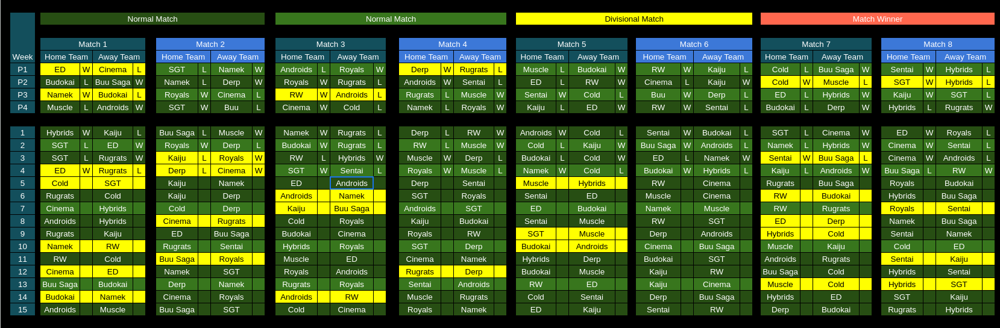

# 2025 Schedule

## Schedule at a glance

If you want to see your team's schedule specifically, check [here](./scheduleByTeam.md).

## Stats spreadsheet

The stats spreadsheet for the season can be found [here](./stats.md).

These are the planned dates for the 2025 season.

5/17/2025 - Dragon Trials week 1
5/24/2025 - Dragon Trials week 2

## Pre-Season

5/31/2025 - Week 1 
6/7/2025 - Week 2 
6/14/2025 - Week 3 
6/21/2025 - Week 4 

## Main Season
6/28/2025 - Week 1 
7/5/2025 - Week 2 
7/12/2025 - Week 3 
7/19/2025 - Week 4 
7/26/2025 - Week 5 
8/2/2025 - Week 6 
8/9/2025 - Week 7 
8/16/2025 - Week 8 
8/23/2025 - Week 9 
 
8/30/2025 - All-Star Break (warm up games) 
9/6/2025 - All-Star Game 

9/13/2025 - Week 10 
9/20/2025 - Week 11 
9/27/2025 - Week 12 
10/4/2025 - Week 13 
10/11/2025 - Week 14 
10/18/2025 - Week 15 
10/25/2025 - Least Valuable Player Tournament 

## Playoffs

11/1/2025 - Round 1 (Match 1) 
11/8/2025 - Round 1 (Match 2&3) 
11/15/2025 - Round 2 (Match 1) 
11/22/2025 - Round 2 (Match 2&3) 
11/29/2025 - Semi-Finals (Match 1) 
11/6/2025 - Semi-Finals (Match 2&3) 
11/13/2025 - Tenkaichi Bowl 
12/20/2025 - Tenkaichi Bowl week 2 

# Kai Placements

## North Kai
* Royals
* Sentai Squad
* Buu Saga
* Kaiju

## East Kai
* Derp
* Earth Defenders
* Cinema
* Rugrats

## West Kai
* Hybrids
* Cold Kingdom
* Super GT
* Muscle

## South Kai
* Resurrected Warriors
* Budokai
* Androids
* Namek
