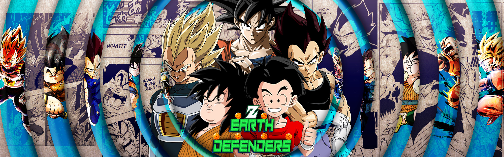

## Earth Defenders

### Theme Description 
- Anyone who fought as or alongside the Z-fighters from the Saiyan Saga to the Buu Saga in a significant fight.

### Team restrictions:
  - N/A

### Current Roster and specific player restrictions

- Krillin
- Base Mid Goku
- Base End Vegeta
  - on loan for Tien
- Yajirobe
  - on loan for Yamcha
- Mid Vegeta (SSJ)
  - Must start in base form or SSJ1
  - Banned from Master Blast, and Rush Blast (2)
  
### Master List
- Adult Trunks
- Chiaotzu
- Early Goku
- Early Piccolo
- End Goku
   - may not have savior if he starts in Base form
- End Vegeta
   - Must start in either bas form or SSj1
   - Banned from Master Blast, and Rush Blast 2
- Future Gohan
- Goten
   - May not have savior if he starts in SSJ
- Hercule
- Kid Gohan
- Kid Trunks
- Krillin
- Late Piccolo
- Majin Buu
- Mid Goku
   - Banned from Kibito’s Secret Art & Secret Measures if starting in SSJ form.
- Mid Vegeta
   - Must start in base form or SSJ1
   - Banned from Master Blast and Rush Blast 2
- Supreme Kai
- Sword Trunks
- Teen Gohan
   - Must start in base or SSJ1
   - If he can transform into SSJ2 form, he cannot have Kibito's Secret Art or Secret Measures.
- Tien
- Yajirobe
- Yamcha
