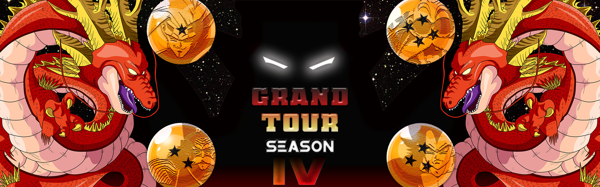

## Team GT 

### Theme Description
- Any character who made significant contribution to the story of DragonBall GT.

### Team restrictions:
  -  GT Goku and SS4 Vegeta have been modded to be unable to fuse in SS4 Gogeta.

### Current Roster and specific player restrictions

- GT Goku (SSJ1)
  -  Cannot start in SS4.
- SS4 Vegeta
  - Banned from Master Blast and Rush Blast 2.
- Syn Shenron
  - Banned from Master Blast and Rush Blast (2) if he has Att+ Blue Potara
- Baby Vegeta (SSJ1)
  - Must start in base form or SSJ 1
- Dr. Gero
  
### Master List
  - Android 17
  - Android 18
  - Baby Vegeta
  - End Goku
  - Final Form Frieza
      - Must be in this form.
      - Cold Kingdom must drop Frieza before he can be picked up by GT.
  - Gero
  - GT Goku
  - Kibito Kai
     - Must start in this form.
  - Krillin
  - Late Piccolo
  - Majin Buu
  - Nuova Shenron
      - Banned from Eternal Life
  - Pan
  - Pilaf
  - Super 17
  - SS4 Vegeta
  - Syn Shenron
  - Super Perfect Cell 
      - Must be in this form.
      - Androids must drop Cell before he can be picked up by GT.
  - Uub