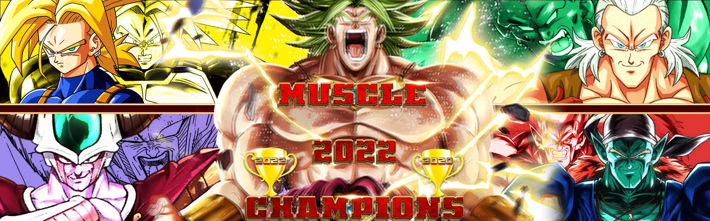

## Muscle

### Theme Description
- The various "Muscle men" of BT3. They need to look one flex away from popping a blood vessel, or be able to transform into that form

### Team restrictions:
  - May not have a free Broly's Ring as a limiter. Broly's Ring may still be used as a normal 1 point potara or via purchase in the boost store.

### Current Roster and specific player restrictions

- Recoome
- Broly (SSJ)
  - May not start in Legendary SSJ Broly form
- Bojack
  - Must start in base form. 
- Android 13
  - Must start in Base form
  - Banned from High Tension and Eternal Life
- Adult Trunks (Base)
  - Must start in base form, or SSJ1 form. 
  
### Master List
- Android 13
- Adult Trunks
- Bojack
- Broly
- Frieza (Final Form)
- Garlic Jr
- Jiren
- Mid Vegeta
  - Must start in base form, or SSJ1 form.
  - Banned from Master Blast, and Rush Blast (2)
- Nappa
- Recoome
- Roshi
- Spopovich

