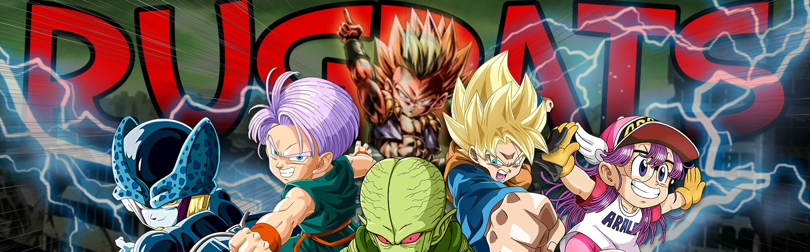

## Rugrats

### Theme Description
- Any character that has a child like body and is either 1) Under age of 12 or 2) has a child moniker (E.g., Kid, Jr)

### Team Specific Restrictions
- If they are able to fuse, Kid Trunks and Goten must have the same build with the exception of 1 blue potara.
- Rugrats may turn transformations off or on.

### Current Roster and specific player restrictions

- Arale
- Kid Trunks (base)
- Goten (SSJ1)
    - May not have Savior if he starts in SSJ1 form.
- Cell Jr
- SS3 GT Goku
  - on loan for Pan

### Free Agent

- Devilman
  
### Master List
- Arale
- Cell Jr
- Chi-Chi
- Garlic Jr
- Goten
    - May not have Savior if he starts in SSJ1 form.
- GT Goku
- Kid Buu
- Kid Gohan
- Kid Goku
- Kid Trunks
- Pan
- Saibaman
- Teen Gohan
   - Must start in base or SSJ1
   - If he can transform into SSJ2 form, he cannot have Kibito's Secret Art or Secret Measures.